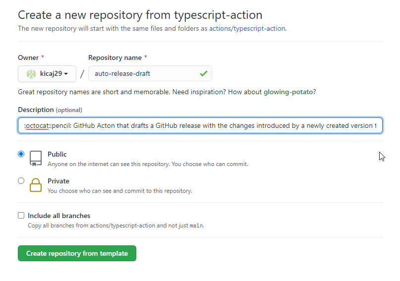
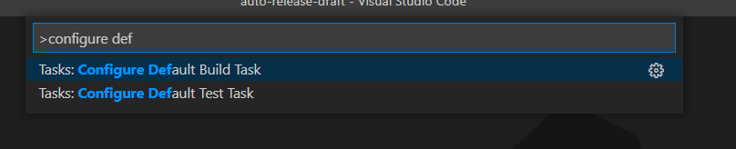
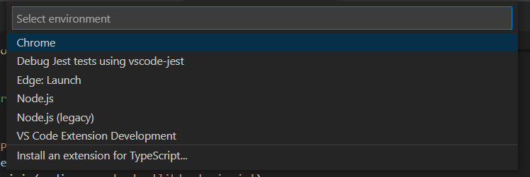
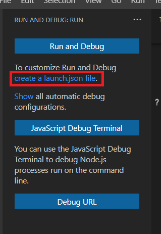
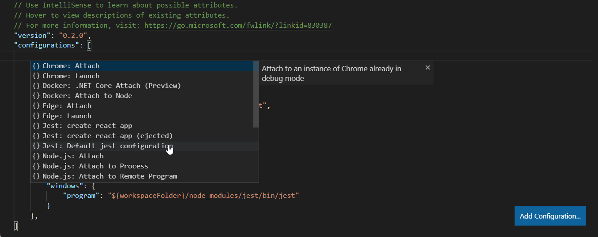
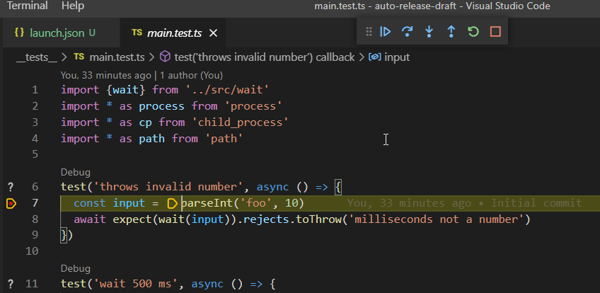
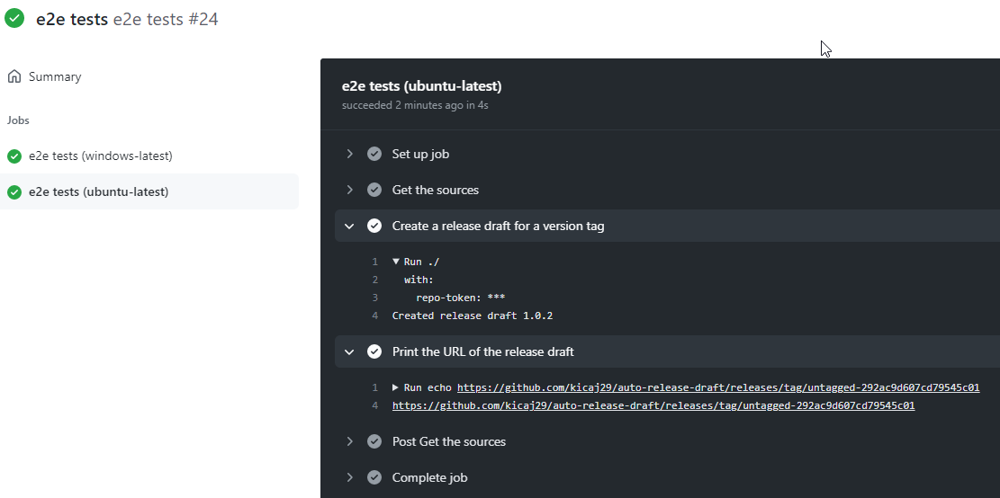
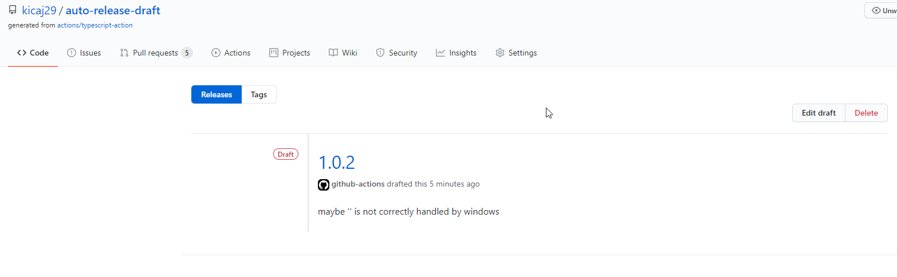

# Intro

It is TypeScript action.
This action creates a GitHub release draft based on a newly created version tag, complete with change log.   

It listens for a github web-hook called ```create``` - it is triggered when someone pushes a new branch or a new tag to repository.
Next it gets list of commits that happened since last version tag and uses their messages to draft a new github release.

# Helpful git commands

```git describe``` - to find last version tag   
```git logs``` - to find commits between the last version tag and the new one just created

# Setting up the environment to debug unit tests for the action

By default it is not possible to debug github actions locally but it is quite easy to debug unit test for github action.
To debug github action locally dedicated tools could be used like this https://github.com/nektos/act but for now it was not investigated.

Go to https://github.com/actions and create a new repo from a template.
We will use TypeScript so go to repo https://github.com/actions/typescript-action.
Next click Use this template to create a new repo: 



Clone the repo and open it with VS code.
Configure default tasks for build (CTRL + SHIFT + B) and test (CTRL + SHIFT + T).
Open command palette to specify what commands(scripts) should be run when we trigger the tasks.



Select ```npm build``` and ```npm test``` for the tasks.
Next run npm install and check that build and tests are ok.

Next configure launching the application. Since it is a github action we cannot simple run it locally outside of the workflow but we can launch test runner and optionally attach node debugger so we can debug our code from the unit tests. 

To do this press `F5` and select `nodejs`:

next select:
.   

A new file `launch.json` will be created which has to be now updated to support jest. To generate configuration for `jest` click `Add Configuration` and select `jest`:


After this you can set breakpoint in a test and press `F5` to start debugging:



# Use created actions

In this repo is committed dist folder because e2e workflow only runs the tests without running a build or reusing earlier run build.   

To regenerate disc folder run (it is needed only when we want use newest version of the action):
```
npm run build
npm run package
```

Next commit the `dist` folder.   

Next add some commits and add tag with proper version:

```
git tag -a v1.0.5 -m "This is version 1.0.5"
git tag
git push --tags
```

After pushing the tag a draft release is published:





To remove tag:

Local branch:
```
git tag -d v1.0.1
```
Remote branch:
```
git push origin :v1.0.1
```

Link to draft releases: https://github.com/kicaj29/auto-release-draft/releases


# links
https://github.com/ecampidoglio/auto-release-draft   
